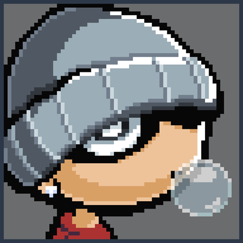

  
  <h1>Zukadote</h1>
  <h4>Menu em Shell Script e Tema para o EmulationStation.</h4>

---

## ℹ️ Sobre
- [**Zukadote.sh**](https://github.com/guilhermesaud/R36H/blob/main/shells/Zukadote.sh) é uma shell com menu interativo desenvolvido para meu uso pessoal, permitindo ajustes rápidos e práticos.
- [**Zukadote**](https://github.com/guilhermesaud/R36H/tree/main/themes/Zukadote) é um tema para o **EmulationStation (ARKOS)**, criado de acordo com minhas preferências.

---

## 🤖 Shell [**Zukadote.sh**](https://github.com/guilhermesaud/R36H/blob/main/shells/Zukadote.sh)
- 📶 **Gerenciamento do Wi-Fi**: Ativar ou desativar.
- 🔧 **Serviços Remotos**: Ligar ou desligar serviços como SSH e SAMBA.
- 💾 **Backup e Restauração**: Criar e restaurar backups de arquivos definidos pelo usuário.
- 🎨 **Tema do Loading**: Alterar a tela de loading ao abrir um jogo.

## 🎨 Tema [**Zukadote**](https://github.com/guilhermesaud/R36H/tree/main/themes/Zukadote)
Em breve

---

## 📸 Capturas de Tela
Em breve

---

## 🛠️ Contribuição
Este é um projeto pessoal, mas sugestões são bem-vindas! Sinta-se à vontade para abrir um issue ou enviar um pull request.

---
